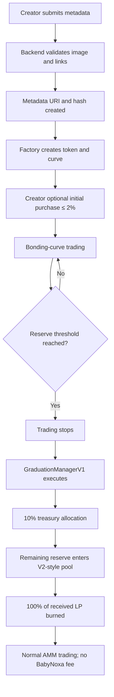

BabyNoxa is a token-launch lifecycle system with three major phases:

1. A creator submits verified project metadata.
2. Users trade against a bonding curve until its reserve target is reached.
3. The project graduates into a V2-style liquidity pool and its LP position is permanently burned.

The explanation below describes the educational/local design. Real-value deployment would require professional auditing and adult-led legal review.

## Complete system flow



# 1. Participants

## Creator

The address that creates a project.

The creator:

- Provides token metadata.
- May make an optional initial purchase.
- Cannot initially purchase more than 2% of supply.
- Receives 50% of bonding-curve trading fees.
- Receives no free token allocation.
- Receives no fee after graduation.

## Trader

A user who buys or sells during the bonding-curve phase.

During local development, Anvil accounts represent traders.

## BabyNoxa treasury

Receives:

- 50% of the 1% curve-trading fee.
- The 10% graduation allocation.
- Minus the capped keeper reimbursement.

It receives no LP under Graduation Manager V1.

## Keeper

Watches for curves that reach `GraduationReady` and calls graduation.

Anybody should be able to call the graduation function. BabyNoxa’s keeper merely makes the process automatic from the user’s perspective.

# 2. Main components

| Component          | Responsibility                                    |
| ------------------ | ------------------------------------------------- |
| Metadata service   | Validates images, names, symbols and social links |
| Factory            | Creates and registers launches                    |
| Token              | Represents the fixed one-billion supply           |
| Bonding curve      | Handles pre-graduation price calculations         |
| Fee accounting     | Separates creator, treasury and reserve amounts   |
| Graduation manager | Converts a completed curve into liquidity         |
| Treasury vault     | Holds claimable BabyNoxa fees                     |
| Indexer            | Reads events for charts and activity              |
| Backend            | Search, metadata, moderation and indexing         |
| Frontend           | Creation, discovery, trading and project display  |

# 3. Metadata preparation

Metadata must be verified before launch creation.

The creator submits:

```text
name
symbol
description
image
website
Twitter/X
Telegram
Discord, optional
```

## Image validation

The backend should:

1. Check the real file type from its bytes.
2. Accept PNG, JPEG or WebP.
3. Fully decode the image.
4. Reject corrupted images.
5. Remove EXIF and location data.
6. Resize oversized images.
7. Convert the result to WebP.
8. Enforce the processed size limit.
9. Calculate the image hash.
10. Store the image.
11. Retrieve it again.
12. Compare the retrieved hash.

## Metadata validation

Recommended limits:

```text
Name:         1–32 characters
Symbol:       2–10 uppercase letters/numbers
Description:  Maximum 500 characters
Website:      HTTPS
Image:        Required
Schema:       Versioned
```

After validation, the backend creates canonical JSON:

```json
{
  "schemaVersion": 1,
  "name": "Example",
  "symbol": "EXAMPLE",
  "description": "An educational launch.",
  "image": "ipfs://image-cid",
  "website": "https://example.com",
  "twitter": "https://x.com/example",
  "telegram": "https://t.me/example"
}
```

It then calculates:

```text
metadata URI
metadata hash
image hash
```

The factory stores the URI and hash so a frontend can detect altered metadata.

## Immutable metadata

These should not change after launch:

- Name
- Symbol
- Image
- Description
- Creator
- Original metadata hash

Social links could be updated through separate versioned metadata records.

# 4. Project creation

The creator calls the factory with:

```text
verified metadata URI
metadata hash
token name
token symbol
optional initial purchase
```

The factory:

1. Validates that required fields exist.
2. Assigns a unique launch ID.
3. Creates or registers the fixed-supply token.
4. Creates the project’s curve.
5. Records the creator.
6. Snapshots the active graduation manager.
7. Starts the lifecycle in `Trading`.
8. Executes the optional initial creator purchase.

## Token rules

Confirmed rules:

- Total supply: 1 billion.
- Decimals: 18.
- No additional minting.
- No transfer tax.
- No blacklist.
- No arbitrary balance modification.
- No creator free allocation.
- No owner-controlled pausing after launch.

## Creator initial purchase

Maximum initial output:

[
1{,}000{,}000{,}000 \times 2%
=============================

20{,}000{,}000
]

The limit applies only to the purchase inside the creation transaction.

After launch, the creator address follows the same token rules as everyone else. There is no permanent maximum-wallet restriction.

# 5. Bonding-curve price

BabyNoxa uses a virtual-reserve constant-product model:

[
x \times y = k
]

Where:

- (x) is the virtual base-currency reserve.
- (y) is the virtual token reserve.
- (k) is the constant product.

The virtual reserves establish an initial price even though the curve begins with no real deposits.

Approximate spot price:

[
P = \frac{x}{y}
]

When users buy:

- The base reserve increases.
- The virtual token reserve decreases.
- The token price increases.

When users sell:

- The virtual token reserve increases.
- The base reserve decreases.
- The token price decreases.

Every calculation must round in the direction that preserves solvency:

[
x_{\text{new}} \times y_{\text{new}} \geq k
]

# 6. Buy lifecycle

A buy conceptually receives:

```text
buyer
input amount
minimum tokens expected
deadline
```

The intended processing order is:

1. Confirm the project is in `Trading`.
2. Confirm the input is greater than zero.
3. Confirm the deadline has not expired.
4. Calculate the 1% fee.
5. Divide the fee 50/50.
6. Use the remaining 99% as curve input.
7. Calculate tokens out.
8. Verify tokens out meets the user’s minimum.
9. Update curve reserves.
10. Transfer or record tokens for the buyer.
11. Update fee accounting.
12. Check graduation progress.
13. Emit a buy event.

## Fee example

For a mock input of `1 ETH`:

```text
Total input:       1.000 ETH
Trading fee:       0.010 ETH
Creator portion:   0.005 ETH
Treasury portion:  0.005 ETH
Curve input:       0.990 ETH
```

The trading fees are not part of the graduation reserve.

# 7. Sell lifecycle

A sell conceptually receives:

```text
seller
token amount
minimum output expected
deadline
```

Processing order:

1. Confirm state is `Trading`.
2. Confirm the seller has enough tokens.
3. Calculate gross curve output.
4. Confirm the curve has sufficient real reserves.
5. Calculate the 1% fee.
6. Divide the fee 50/50.
7. Verify net output meets the user’s minimum.
8. Update reserves.
9. Return tokens to curve inventory.
10. Record or transfer output to the seller.
11. Update fee accounting.
12. Emit a sell event.

Example:

```text
Gross sell output:  1.000 ETH
Trading fee:         0.010 ETH
Creator portion:     0.005 ETH
Treasury portion:    0.005 ETH
Seller receives:     0.990 ETH
```

# 8. Separate accounting

BabyNoxa must never treat the entire contract balance as curve liquidity.

Conceptually:

```text
Contract balance
├── Real curve reserves
├── Creator trading fees
├── Treasury trading fees
├── Graduation treasury allocation
└── Pending mock refunds
```

The relationship should always be testable:

```text
accounted balance
=
curve reserve
+ creator fees
+ treasury fees
+ refunds
```

Creator and treasury fees use pull accounting:

```text
claimableCreatorFees[creator]
claimableTreasuryFees
```

Trades should not send fees directly to their recipients because a failing recipient could block every trade.

# 9. Graduation threshold

Graduation depends on the curve’s current real reserve—not historical volume.

For example:

```text
Buys add to reserve
Sells reduce reserve
Trading fees do not enter reserve
```

A project graduates only when:

```text
real reserve ≥ configured graduation threshold
```

The mainnet threshold remains undecided. For local Anvil lessons, a small threshold can be used entirely as fake development value.

# 10. Threshold-crossing purchase

Suppose the curve requires another `0.05 ETH`, but the final buyer submits `0.20 ETH`.

The curve should:

1. Calculate only the amount required to complete the curve.
2. Execute that portion.
3. Charge fees only on the executed portion.
4. Record or return the excess.
5. Set state to `GraduationReady`.
6. Reject further curve trading.

This prevents the final buyer from overpaying.

# 11. Automatic graduation

Graduation uses two logical transactions:

## Transaction one: final buy

The final buy:

- Reaches the reserve threshold.
- Stops curve trading.
- Changes the state to `GraduationReady`.

## Transaction two: graduation

A BabyNoxa keeper quickly calls graduation.

The function is permissionless, so another address can call it if the official keeper does not.

This gives an automatic user experience without making the final buyer execute the expensive pool-creation logic.

# 12. GraduationManagerV1

The factory records the graduation-manager version when the token launches:

```text
Launch A → GraduationManagerV1 forever
Launch B → GraduationManagerV1 forever

Future V2 activated

Launch C → GraduationManagerV2
```

Existing projects cannot be moved to a different manager.

## V1 graduation calculation

Suppose the real reserve reaches `10 ETH`.

```text
Graduation reserve:       10 ETH
Graduation allocation:     1 ETH
Liquidity reserve:         9 ETH
```

The 10% allocation goes to the BabyNoxa treasury.

The keeper’s capped reimbursement is taken from that 1 ETH treasury portion:

```text
Treasury receives
=
graduation allocation
− keeper reimbursement
```

The liquidity reserve must never pay the keeper.

# 13. Price continuity

The first AMM price should approximately equal the curve’s final price.

Terminal curve price:

[
P_{\text{curve}} =
\frac{x_{\text{terminal}}}{y_{\text{terminal}}}
]

Required liquidity tokens:

[
T_{\text{liquidity}} =
\frac{E_{\text{liquidity}}}{P_{\text{curve}}}
]

Where:

- (E\_{\text{liquidity}}) is the remaining 90% reserve.
- (T\_{\text{liquidity}}) is the token amount paired with it.

Without this calibration, there could be an immediate price gap between the curve and the AMM.

Any token allocation not required for liquidity should be permanently burned rather than given to the creator or treasury.

# 14. LP policy

Graduation Manager V1 uses:

```text
Burned LP:   100%
Treasury LP: 0%
Creator LP:  0%
```

All received LP is sent to the conventional dead address:

```text
0x000000000000000000000000000000000000dEaD
```

A future manager could implement a different policy, but only for launches created under that new version.

# 15. After graduation

After V1 graduation:

- Curve trading remains closed.
- The project trades through the AMM.
- BabyNoxa collects no additional trading fee.
- Creator collects no additional trading fee.
- The token remains tax-free.
- Initial LP cannot be withdrawn.
- Frontend changes from curve mode to AMM mode.

# 16. Events and indexing

Important conceptual events:

```text
LaunchCreated
MetadataCommitted
TokensPurchased
TokensSold
CreatorFeeAccrued
TreasuryFeeAccrued
GraduationReady
GraduationExecuted
LiquidityCreated
LiquidityBurned
```

The backend indexer reads these events to build:

- Activity history
- Price charts
- Volume
- Creator pages
- Graduation progress
- Holder displays
- Trending lists

Events are historical records. Contract state remains the source of truth for current balances and lifecycle status.

# 17. Backend responsibilities

The backend manages:

- Metadata
- Images
- Search
- Comments
- Moderation
- Charts
- Event indexing
- Trending calculations
- Audit logs

It must not control:

- User balances
- Curve reserves
- Token supply
- Fee ownership
- Graduation state

# 18. Frontend responsibilities

Main pages:

```text
/                 Project discovery
/create           Creation form
/token/:id        Project and trading page
/portfolio        User activity and balances
/admin            Moderation
```

The project page displays:

- Verified metadata
- Creator
- Current lifecycle state
- Curve progress
- Price
- Mock reserve
- Trade history
- Creator holdings
- Graduation-manager version
- LP policy

# 19. Essential invariants

Your Foundry invariant tests should eventually prove:

1. Supply never exceeds one billion.
2. Creator initial purchase never exceeds 20 million.
3. Curve reserves never become negative.
4. Curve inventory never becomes negative.
5. Constant product never decreases unexpectedly.
6. Fees never count as graduation reserves.
7. User cannot sell more than their balance.
8. Curve trading stops at graduation readiness.
9. Graduation can execute only once.
10. Keeper reimbursement never exceeds its cap.
11. Keeper reimbursement comes only from the treasury allocation.
12. Graduation Manager V1 gives treasury zero LP.
13. Graduation Manager V1 burns all received LP.
14. Existing launches cannot change manager versions.
15. Metadata hashes cannot be silently replaced.

# 20. Decisions still pending

These parameters must be simulated before being finalized:

- Graduation hard cap
- Initial virtual base reserve
- Initial virtual token reserve
- Exact curve token allocation
- Exact liquidity token allocation
- Maximum keeper reimbursement per network
- Image size and storage provider
- Social-link update rules
- Moderation and reporting policy

Those parameters affect starting price, terminal valuation, tokens sold and graduation-price continuity. They should be chosen from curve simulations rather than guessed.
